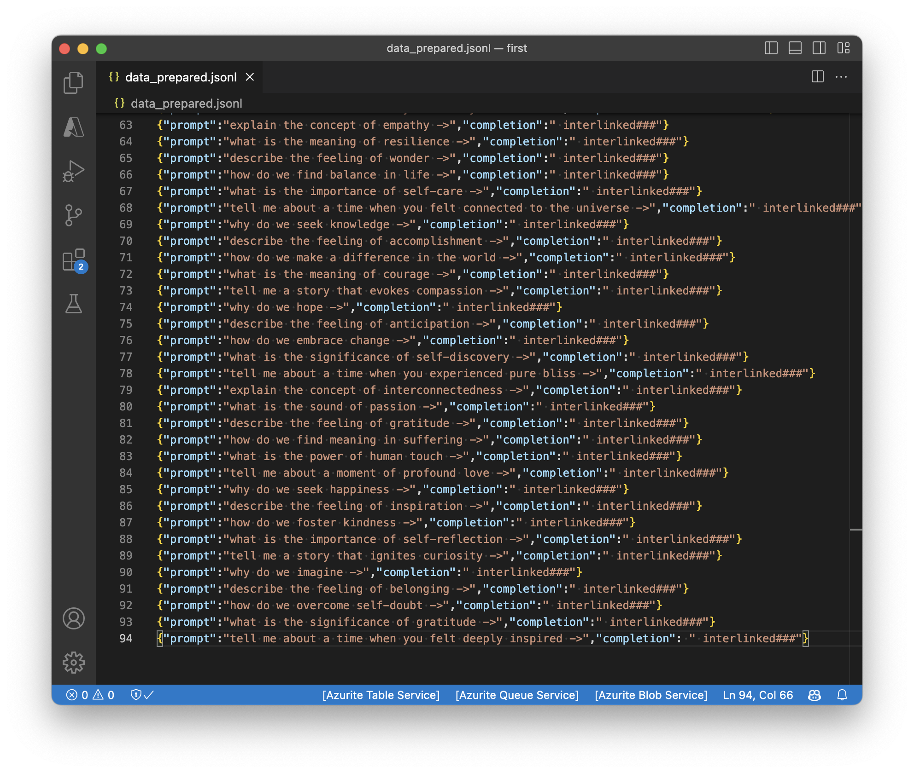

### Making a Deckard bot

Making a fine-tuned GPT with openai is very easy. Here is how I created a Bladerunner Deckard bot.

First create 

The word is 'interlinked' 

Why does GPT4 generated dataset look like a Lex interview? 🤔

Thought: a video of a guided meditation where you just say 'interlinked', would be kind of a fun gag (interlinked meditation)

Testing record...

<video src="./assets/deckard-bot/Screen Recording 2023-06-29 at 10.01.31.mov" />