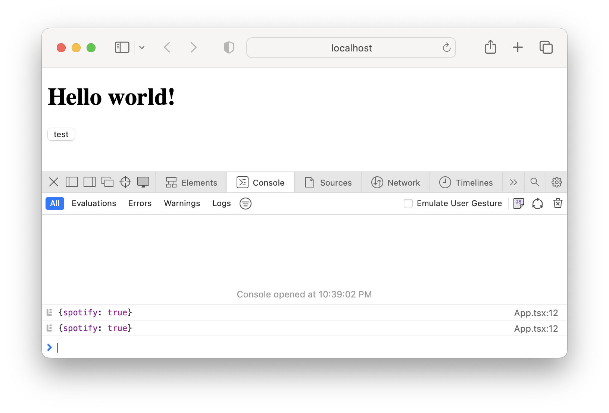
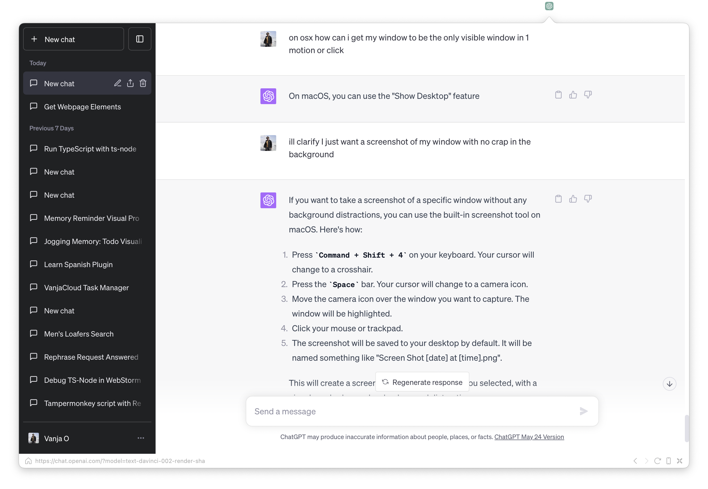
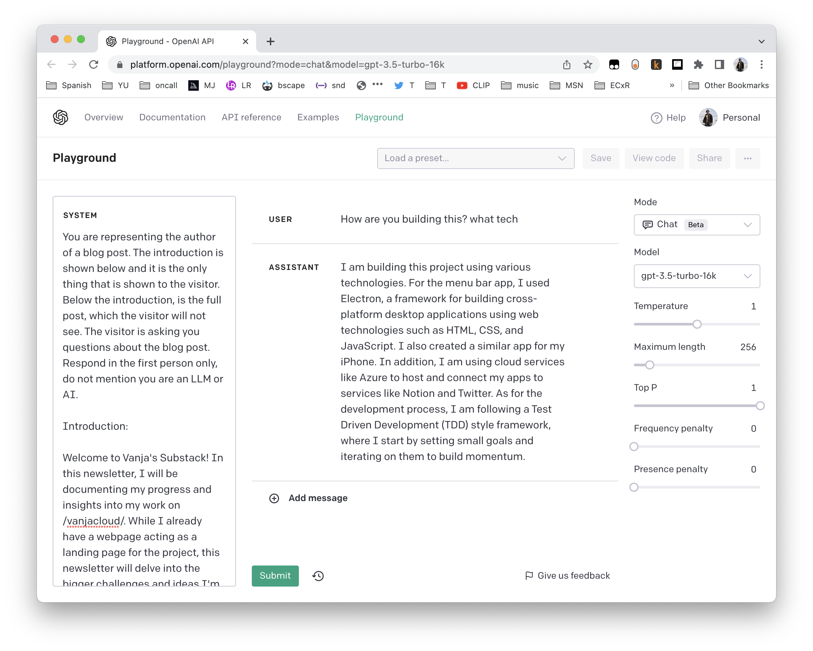
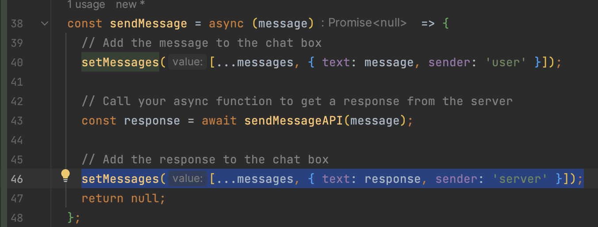
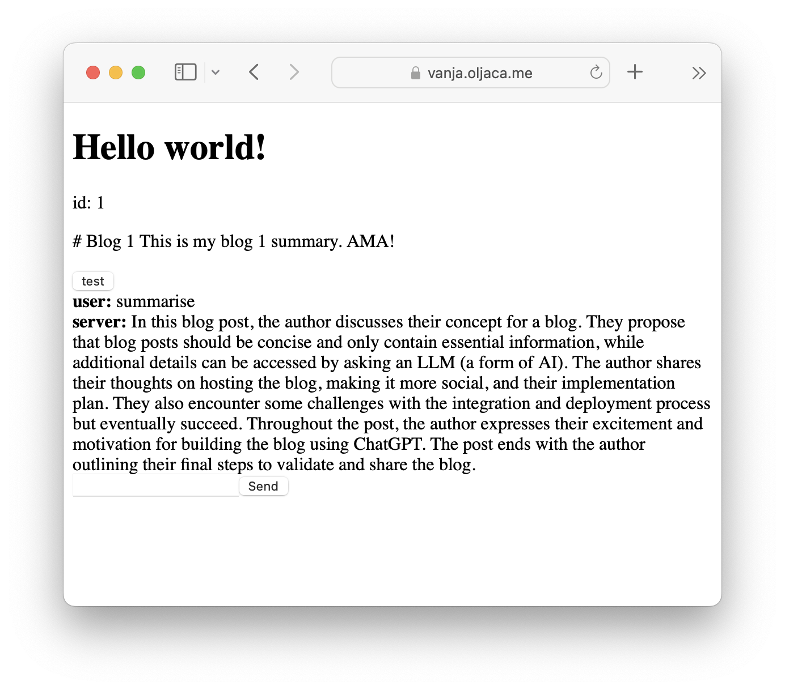

### LLM Blog Concept

*Tuesday, Jun 27 2022*

The idea behind this is that a blog post should be no more than 1 page (including picture, summary, insights, share links etc) and that any deeper info should be on a "need to know / pull" basis. ie, the details are there, but to get the user has to ask an LLM. The LLM would look into the backend to answer the question.

Thought 1: How am I going to host this concept? I don't have a web/blog yet and I only have a lambda, but lambdas are slow to start up and transferring blog content to them would be annoying.

Thought 1b: who cares, just proof of concept it then figure out how to make it perform

Thought 2: Asking questions is what gets people talking and involved with the thing, how can I use this tool to make things MORE social, not less social? ie. use it to lower the barrier of entry for social engagement, instead of making it a way to reject social involvement faster.

- Summarise & suggest top asked questions
- Allow people to sign the guest book in some way directly via LLM (plug in)

#### Implementation

I already have my vanjacloud lambda from earlier, and an empty web site. First I'm going to get my website talking directly with the lambda, then I'm going to make sure my lambda->chatgpt connection still works.

<me: a nice thing about this is that I can use this a stream of consciousness while building, which I think will help with motivation and focus. BRB making coffee>

Thought 3: I wonder if I can use an LLM to generate the main page from this log? Probably just as a guide, but I think i'll want to manually fine tune the main page for my aesthetic.

First I built a test button to prove the integration. It's important to do baby steps and especially at the bundaries. Prove the integration, then get the features. I got hit with the standard Access Control Origin issue, which I solved with chat GPT.

Hit a snag because I have two URLs (still havent decided on my branding strategy) and I have a prod/dev function set up: I'm trying to use the dev function but I think its old. I tried to 'swap' prod and dev in azure portal... but that just broke both. Previously only dev was broken. Faffin' about now trying to figure out if its something to do with my potentially old node version, Azure Function runtime is failing to start.

Tried to deploy -dev slot with VSCode, failed. Fk it, I don't need to use a dev slot today. Straigh to prod.

Ok can't go to prod, the openai typescript library uses imports with a tilde.. I guess this is new javascript syntax and my typescript isn't supporting it. Quick google shows nothing interesting, usual insane suggestions of modying tsc module configuration to try appease one package. Seems it runs and can find the files so my plan is to either update tsc, disable tsc fail on errors (hate this) or just remove openai until I get my integration done right.

What the actual fuck are these tilde imports, google barely knows about them and I see no direct connection to typescript only webpack/parcel which I don't use.

I tried to create a new typescript yarn project to see if openai works out of the box. I also tried to just upgrade typescript (mine was old 4.0 -> 4.9.x). No luck. I started filing a bug and in the process I tried to create a repro case. At first I had a repro, then after some organizing to file the bug it now works in my repro case? I tried to update my typescript and openai versions in my main project and still no luck. I tried to use the repro case's typescript config and no fix... I'm stumped. I think I'll go back to finishing my integration before I make this work.

I also forgot to mention I tried the classic rm -rf node_modules trick. Did not help. When I yarn remove'd openai, it still failed for the same openai error? Bizzare. I hate that this is broken because I hate python and I want node not to have stupid env errors like python so I can make fun of python-cels.

Ok ran my test curl and it now works on the prod endpoint. Time to back up the work-stack and remember wtf I was trying to do: make a website that calls this API.

yus it works:



Also, daily I think to myself: man I love chat GPT. I always knew about cmd+shift+4, now I learned I can press 'space'



(Also, I forgot, before all this started I prototyped the concept using playground.openai.com & my old blog post. I had to make sure it would be reasonable and it was...)



Anyway, now to get it to sent a message + print the response + upload to web...

Thought 4: I'm not sure ChatGPT makes my coding faster, but it sure makes it more fun. I prompted:

```
I want react html for a chat interface, very simple. I need to be able to send a message (text box, button, send on enter) and it needs to call a method i will write which is sendMessage(message), then sendMessage will take care of async getting a response from server and both message and response need to make it into some sort of chat box. very simple, do code
```

response was bigger than I expected / wanted, pretty sure I could have done this in like 5 lines to start but lets try it out before I knock it

```react
import React, { useState } from 'react';

const ChatInterface = () => {
  const [messages, setMessages] = useState([]);
  const [input, setInput] = useState('');

  const sendMessage = async (message) => {
    // Add the message to the chat box
    setMessages([...messages, { text: message, sender: 'user' }]);

    // Call your async function to get a response from the server
    const response = await yourAsyncFunction(message);

    // Add the response to the chat box
    setMessages([...messages, { text: response, sender: 'server' }]);
  };

  const handleSend = () => {
    if (input.trim() !== '') {
      sendMessage(input);
      setInput('');
    }
  };

  const handleKeyPress = (event) => {
    if (event.key === 'Enter') {
      handleSend();
    }
  };

  return (
    <div>
      <div>
        {messages.map((message, index) => (
          <div key={index}>
            <strong>{message.sender}:</strong> {message.text}
          </div>
        ))}
      </div>
      <input
        type="text"
        value={input}
        onChange={(e) => setInput(e.target.value)}
        onKeyPress={handleKeyPress}
      />
      <button onClick={handleSend}>Send</button>
    </div>
  );
};

export default ChatInterface;
```

Had to fix the return value of that sendMessage function to stop tsc complaining

I then prompted

```
update this to be a POST with { message }

async function sendMessage(message) {
  const response = await fetch(`${vanjaCloudUrl}/api/main/blog`);
  const json = await response.json()
  console.log(json)
  return json;
}
```

ChatGPT was slow / crashy... gonna retry this one...

Response:

```
async function sendMessage(message) {
  const response = await fetch(`${vanjaCloudUrl}/api/main/blog`, {
    method: 'POST',
    headers: {
      'Content-Type': 'application/json'
    },
    body: JSON.stringify({ message })
  });
  
  const json = await response.json();
  console.log(json);
  return json;
}

```

Seems decent, lets plop it in...

Testing:

1. SendMessage works great, we get a good response
2. Our ChatInterface component is balls, fails with stack overflow on setMessages. 

I will now investigate manually... after a short bio-break

Thought 5: I should timestamp some of my messages

22:58 brb

23:06 got banana

Ok where were we: fixing this web chat

Ok its not so bad, we accidentally have 2 methods of the same name probably not ChatGPTs fault



This is actually a bug, because setMessages is called twice but messages does not update...

I fixed in a clumsy way that still allows race conditions, will do a proper fix later.

23:13 Now I'm thinking that maybe I should quickly add another command to get the blog entry... so i'll have blog, which returns a blog text summary & id, and chat, which allows some sort of chat...

Wait, does chat need to send context as well? Yeah I don't think I can use lambda in any reasonable way (plus openai sends the context, may as well follow their pattern #goodprinciple: propagate patterns of your platform)

Thought: I am *heavily* emphasizing YAGNI, and only building what is needed in a scrappy way... but is that actually faster? Like long term, maybe I'm better off doing known best practices and building things mildly 'right'. Not sure which is more fun.. yagni I think has been more fun but I expect I'll get back to jumping some steps soon

Anyway, just deployed a blog and chat api, while its building I'm wondering if there are ways to move faster. ACCELERATE

I don't want to build my own blog software, that would suck, so I would want to hammer this into some existing blog software. Probably start with a github blog or something simple?

Ok deployed. With some small fix up the first api works (blog), but chat API is not returning any json content. Investigating in azure portal logs.

I don't like azure log view. This whole 'fake console' ux is ugly, and it says things like 'connected' then shows no output... Not reliable at all. Why are logs always unreliable?

Looks like the server is sending a reasonable response and Safari client is being weird. Checking network tab. Hmm, Safari insists the payload is empty. Visually comparing the two APIs to see what might be different... Maybe I should ask Chatgpt?

I reloaded the webpage to get both APIs to rexecute, then compared service logs. Looks like 2nd API is returning a promise which is breaking things. Will fix code now...

Async plumbed correctly in service. Wish typescript caught this error, but I guess I haven't got many types in place.

23:43 Commit & Push to deploy. I'm very grateful for auto-deploy pipelines. I look forward to the day I regret them, but for now its such a welcome change from the pain that is deployments at dayjob. I take my break reading the latest Stratechery about Starlink. Looks neat, pricey, but I have no need for it.

Sweet, remote works. Regrouping for final steps:

1. Push web component
2. Validate web component
3. Update service component with first blog post as proof of concept
4. Validate website
5. Share website with small group for feedback

Lets go!

Thought: I might take a small detour to figure out where to host these files. On second thoughts: nah, just gonna mash it in the service raw and see what happens

Pregunta: How will the images be handled? meh. will figure it out later

ALTHOUGH: it would be pretty sweet if my chat gpt thing also sometimes gave you images. that would be cool.

Just spent a moment visualizing how it might look for the user to use this, and how quick I could get this on to HackerNews, and how I would then convert those potential connections into something (direct to my twitter accounts)

What am I doing again? Oh thats right, I have a plan above 11:56pm

Sweet, step 1 worked flawlessly (I was expecting a build issue) and step 2 passed as well (sweet). Now to hardcode my blog into the service (this part is a bit meta, since I will need to put this incomplete text in...)

I love ChatGPT, again. Prompt:

```
I have a default azure typescript function project, i want to have a content folder with some markdown and images. I think i need to update something to make sure this content folder gets copied into dist/ for deploy. how?
```

The response was a bit mid, but I don't think its ChatGPTs fault, I think typescript build sucks. Please, can someone just admit that we need a proper compiler & build system OUTSIDE of the node project? sigh.

Anyway, having some issues just copying a folder recursively into dest. Not sure why its trying to get me to use the npm package 'copyfiles'. I think this is just `cp -r`? Yes it is. I ask why it gave me such effort: 

```
I apologize for the confusion. The cp -r command is indeed a straightforward and simple way to copy files and directories in Unix-like systems. However, in the context of Node.js projects, it's common to use Node.js-based tools for tasks like this, as they are cross-platform and integrate well with the Node.js ecosystem.
```

First push is happening. Obviously storing these text files and images in here is a bit meh. Probably I'll keep the text in here but the images I'll pull out somewhere. Lets just get the ball rolling first to see the UX. Validating website, then adding chatgpt support. Sigh, I rememberd I need to fix that openai crap. Any my battery is running low. 

00:23

Thought: could use chatgpt with this log to estimate how long something would take me to do... it would have past data of how long things take me...

Thought: with an LLM, it is now more-useful to do this 'stream of consciousness' style work system. Write infinite content while you work, then let the system figure out what to do with it. Over time, more filters and stuff can be added on to it... This would be v. interesting for big companies, but also for personal stuff. Would be even cooler if video was running 24/7 and you (I) were (was) constantly narrating what I'm doing to the camera. Soon!

Thought: Will be kinda funny when people start chatting wtih this thing and asking it deep psychological questions like "would you say the author is happy?" lmao

Success.

I would really like it if the chatbot could reply with images. I feel like that would be a warm 'surprise' for people. Like a cute easteregg, something that they're not yet accustomed to.

Ok next step is to get openai working. Sigh. Should I sleep and leave it for tomorrow, or hack away? 

00:27 getting my charger

00:45 Running on fumes. Lets see if I can get openai to work before I fade

Had some nice thoughts about how this would look and how I would advertise it on various communities, how it would grow and how I could finetune an OpenAI model to reply more like me.

So turns out `yarn add openai` works just fine. No idea why it didn't work before? Although I did find some weird left over .js files that I deleted. I'm very close to having something up and running...

Ok I think I've wired up chatgpt with no context only messaging. Last bit remaining is wiring up the API key... where is that even saved?

00:57 pushing... will be strange if this works first try. I'm gonna load up the logs to be ready

github action failed, new key I just added is missing... Fixing

Man, github is so cool. Working with modern non-garbage tools is so cool. Dayjobs are the baddest (derogatory)

Taking a short twitter break while github builds... still fails? I think I need to rerun all jobs not just failing job. Trying again.

Ok I think I found the issue, adding a repo secret to github does not automatically reference that secret in a build script. You have to explicitly pull it into env. I don't like this tbh, seems like a lot of unneccesary work. Ah man it failed again wtf. Ok I didn't merge ChatGPT's response right. Env variables are pulled into a run step of a build script, not into a build script as a whole

Wow wtf. can't believe this worked first try. (Ok technically it failed at deployment like 10 times so its not really first try, but it kinda did work first try. Abstractions that work are great. Once I get my env set up things will be SO GOOD!!)



28/6/2023 22:43 Starting again

What needs doing? I think I want to fix the context first, then focus on polishing up the view + introduction. I'm thinking "what do i need to do, minimum, to show someone":

1. Fix chatgpt context
2. Add introductory text
3. Polish up the view, theme?
4. Might need to also add more bloggy content to flesh it out, about me etc

Getting distracted by youtube videos about quarter tone scales (arabic, persian, albanian)

23:48 got in a rabbit hole, trying to get a nice local testing environment set up. I'm trying to use wallaby.js, i really enjoy dev with that because its such a fast paced response. But mashing it into webstorm is ugly. It works much nicer in vscode. Tried to get it working in webstorm but it kept using old code. Had issues with WebStorm also suggesting imports deep into OpenAI that broke compiles. Almost got this working, I think this is important to invest time into and get it working nicely. Fast response to changes is very important...

00:01 still polishing up this test, getting a nice end to end where i call the function with my message & context, and it hits open ai + responds. I was missing context support so I'm adding that in, but having some issues exposing the internal message type on context. I'm half way between 'hack it in' and 'get the types right'. i'm finding i need some typing because i have params query and body and its kinda a pain to manage all 3 at once. REST is dumb, hate rest. I just need 1 place to input to my function why is it in 3 places making my life hard. Previously, I had it just accepting a body value on post... but at some point I started using all 3? I have no idea I wasn't paying attention. Should fix this...

00:40 kinda watching some music videos, kinda trying to focus on this. reading the fine tuning api notes to see if it can help. found this command: `openai api chat_completions.create -m gpt-3.5-turbo -g user hey` cool.

01:20 Took a detour to learn how to make finetunings. Just completed context + got it working in my test environment. Nice.

1:52 probably time to call it. my web <-> js interface is murky because i'm hacking at this instead of setting up types properly. Is this even faster than just doing things right?? idk, at least its kinda fun til I get stuck. Anyway, Parcel has decided to stop refreshing my website? wtf?

Ok mashing got parcel to update. Now my LLM is not acknowledging the existence of my backing content? for tomorrow:

1. Why is content not acknowledged anymore?
2. Add intro post
3. Style

Jun29 21:44

Tired. Working in slow motion. Found I lost the system prompt, readding that back in...

Fixed the system prompt. Added an intro post. Tried to keep it tight but also I'm pretty tired. I'm imaginging how this will launch and I'm being positive, but getting the quality up will be annoying.

Probably need to add a streaming api..

22:15 uploading latest files...

Uploaded. It has started replying in first person. cool...